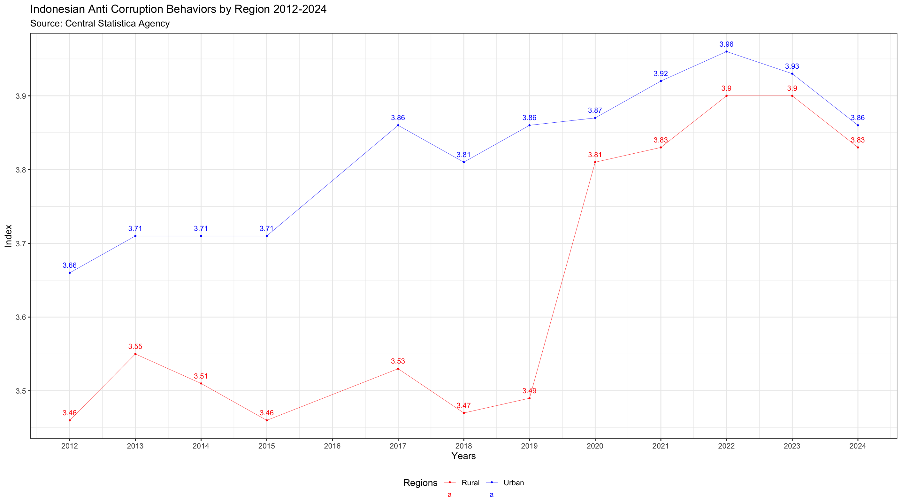
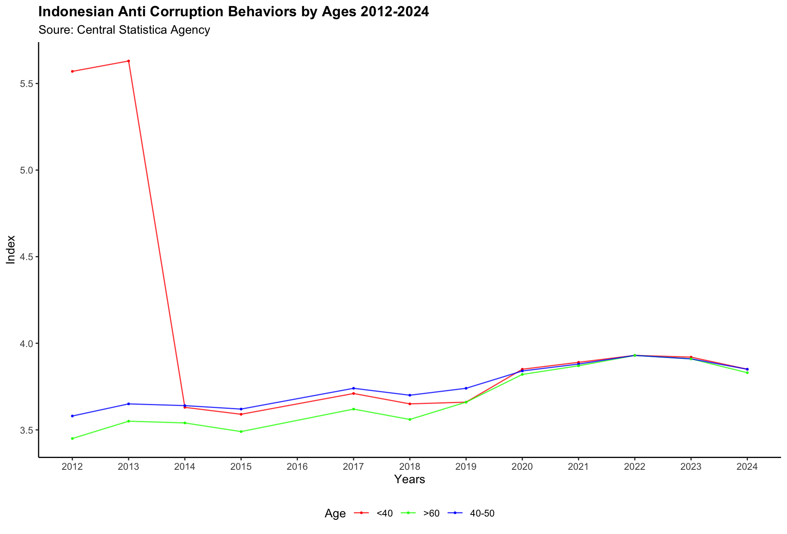

# ANTI-CORRUPTION BEHAVOR INDEX (IPAK) INDONESIA
From the R Language Programmer, this project produces visual development data for Indonesia's anti-corruption behavior (IPAK) 2012 - 2024. Project data collection from [the Indonesian Central Bureau of Statistics](https://www.bps.go.id/id/statistics-table?subject=526). This project also plays a role in reviewing and criticizing Indonesia's anti-corruption behavior.

## [Anti-Corruption Index (IPA) Indonesia by Regions 2012-2024](https://www.bps.go.id/id/statistics-table?subject=526)

### Read Data Base 
```r{}
library(readxl)
anticorruptbehaviorbyregion <- read_excel("~/Desktop/Data Github/anticorruptbehaviorbyregion.xlsx")
View(anticorruptbehaviorbyregion)

library(knitr)
anticorruptbehaviorbyregion <-kable(anticorruptbehaviorbyregion, format = "markdown")
cat(anticorruptbehaviorbyregion)
print(anticorruptbehaviorbyregion)

```
|Regions | Index| Years|
|:-------|-----:|-----:|
|Urban   |  3.66|  2012|
|Urban   |  3.71|  2013|
|Urban   |  3.71|  2014|
|Urban   |  3.71|  2015|
|Urban   |  3.86|  2017|
|Urban   |  3.81|  2018|
|Urban   |  3.86|  2019|
|Urban   |  3.87|  2020|
|Urban   |  3.92|  2021|
|Urban   |  3.96|  2022|
|Urban   |  3.93|  2023|
|Urban   |  3.86|  2024|
|Rural   |  3.46|  2012|
|Rural   |  3.55|  2013|
|Rural   |  3.51|  2014|
|Rural   |  3.46|  2015|
|Rural   |  3.53|  2017|
|Rural   |  3.47|  2018|
|Rural   |  3.49|  2019|
|Rural   |  3.81|  2020|
|Rural   |  3.83|  2021|
|Rural   |  3.90|  2022|
|Rural   |  3.90|  2023|
|Rural   |  3.83|  2024|

### Indonesian Anti Corruption Behaviors Index by Province 2012-2024 
```r{}
library(ggplot2)
ggplot(anticorruptbehaviorbyregion, aes(x = Years, y = Index, group = Regions, color = Regions)) +
  geom_line(size = 0.2, alpha = 0.8)+
  geom_point(size = 0.2) +
  geom_text(aes(label = round(Index, 2)),
            vjust = -1, hjust = 0.5, size = 3) +
  theme_bw() +
  labs(title = "Indonesian Anti Corruption Behaviors by Province 2012-2024",
       subtitle = "Source: Statistic Center Agency",
       x = "Years",
       y = "Index") +
  theme(legend.position = "bottom") +
  scale_x_continuous(breaks = seq(2012, 2024, by = 1)) +
  scale_color_manual(values = c("Urban" = "blue", "Rural" = "red"))
```


### General Analysis Indonesian Anti Corruption Behaviors Index by Region 2012-2024

Increased National Awareness, Despite fluctuations in rural areas, both regions showed an overall increase from 2012 to 2024. This may reflect the government or related institutions' continuous efforts to strengthen anti-corruption programs across the country.
Challenges in Rural Areas, For rural areas, despite an increase after 2020, challenges seen from previous data fluctuations indicate that there are areas that still need more attention, especially in terms of law enforcement and public awareness.

## [Indonesian Anti - Corruption Behaviors by Ages 2014-2024 ](https://www.bps.go.id/id/statistics-table/2/MTQ5OSMy/indeks-perilaku-anti-korupsi--ipak--menurut-kelompok-umur.html)

### Read Data Base
```r{}
library(readxl)
ipakbyage <- read_excel("~/Desktop/Data Github/ipakbyage.xlsx")

library(knitr)
ipakbyage <-kable(ipakbyage, format = "markdown")
cat(ipakbyage)
print(ipakbyage)

```
|Age   | Index| Years|
|:-----|-----:|-----:|
|<40   |  5.57|  2012|
|<40   |  5.63|  2013|
|<40   |  3.63|  2014|
|<40   |  3.59|  2015|
|<40   |  3.71|  2017|
|<40   |  3.65|  2018|
|<40   |  3.66|  2019|
|<40   |  3.85|  2020|
|<40   |  3.89|  2021|
|<40   |  3.93|  2022|
|<40   |  3.92|  2023|
|<40   |  3.85|  2024|
|40-50 |  3.58|  2012|
|40-50 |  3.65|  2013|
|40-50 |  3.64|  2014|
|40-50 |  3.62|  2015|
|40-50 |  3.74|  2017|
|40-50 |  3.70|  2018|
|40-50 |  3.74|  2019|
|40-50 |  3.84|  2020|
|40-50 |  3.88|  2021|
|40-50 |  3.93|  2022|
|40-50 |  3.91|  2023|
|40-50 |  3.85|  2024|
|>60   |  3.45|  2012|
|>60   |  3.55|  2013|
|>60   |  3.54|  2014|
|>60   |  3.49|  2015|
|>60   |  3.62|  2017|
|>60   |  3.56|  2018|
|>60   |  3.66|  2019|
|>60   |  3.82|  2020|
|>60   |  3.87|  2021|
|>60   |  3.93|  2022|
|>60   |  3.91|  2023|
|>60   |  3.83|  2024|

### Analysis Indonesian Anti-Corruption Index by Ages 2012-2024 

```r{}
library(ggplot2)
ggplot(ipakbyage, aes(x = Years, y = Index, group = Age, color = Age)) +
  geom_line(size = 0.5, alpha = 0.8) +
  geom_point(size = 0.5) +
  theme_classic() +
  labs(title = "Indonesian Anti Corruption Behaviors by Ages 2012-2024",
       subtitle = "Soure: Central Statistica Agency",
       x = "Years",
       y = "Index") +
  theme(plot.title = element_text(face = "bold"))+
  theme(legend.position = "bottom") +
  scale_x_continuous(breaks = seq(2012, 2024, by = 1)) +
  scale_color_manual(values = c("<40" = "red", ">60" = "green", "40-50" = "blue"))

```




### Interpreting Changes in the Anti-Corruption Behavior Index Values ​​by Age
Each line represents a different age group, and you can see how the anti-corruption index has evolved over the years for each age group: Interim ResultsYounger age groups (<40) Are more susceptible to declines in anti-corruption behavior. This could indicate that the younger generation needs more attention in anti-corruption campaigns or education.Middle age groups (40-50) and the elderly (>60) Are more stable and have an upward trend in anti-corruption behavior. This could indicate that the older generation may have a stronger understanding or involvement in anti-corruption behavior.

